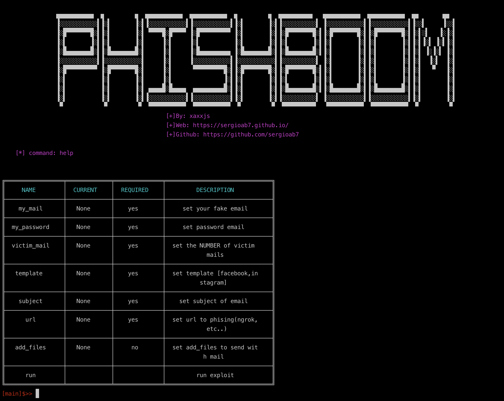

<p align="center">

</p>

<h1>Phishboom</h1>


<p>Se trata de un script hecho en python que te permite enviar correos (tantos como quieras) con plantillas ya por defecto a las personas que tu elijas para redirigirlas a la página que tu quieras.</p>
<p>Tienes que poner los datos que te piden y en la opción template te dan a elegir entre 2 opciones: Facebook o Instagram</p>


<p align="center">

</p>

<p> Para establecer los parametros basta con poner: <b>set 'NOMBRE_PARAMETRO'  'TU_OPCION' </b> y automáticamente se añadirá. </p> 
<p> Todos los parámetros son obligatorios a excepción de las imagenes adjuntas </p>

<h1>Información de la versión </h1>

<p>Actualmente solo puedes enviar mensajes a través de cuentas <b>gmail</b> en pocos días añadiré mas opciones de correo.</p>


## :crystal_ball: Requisitos

<p>Para poder enviar mensajes debemos hacer los siguientes pasos</p>
<p> Debemos ir a google y poner: <b> App password </b> y en mi caso elijo la 3 opción </p>

<p align="center">

</p>

<p> A continuación añadiremos el correo con el que queramos enviar el phising a los usuarios</p>
<p> Y finalmente seleccionaremos la opción: <b>correos</b> y el dispositivo que vayas a usar personalmente y le daremos a: <b>generar</b> y copiaremos la contraseña que nos den<p>

<p align="center">

</p>

<p> Esta será nuestra contraseña que usaremos para el campo <b>password</b> </p>


<p align="center">

</p>


## :heavy_check_mark: Funcionamiento y descarga

<p>La mejor opción es crearlo desde un entorno virtual <b>(RECOMENDADO)</b><p>

```python
git clone https://github.com/sergioab7/phishboom
cd phisboom/
python3 phishboom.py
```
<p>Una vez iniciado el script, pasamos a ver las opciones que tenemos con el comando <b>help</b></p>
<p>Añadimos las opciones que queramos enviar y con el template seleccionado (facebook o instagram) y al completar las opciones le damos <b>run</b></p>

<p align="center">

</p>

<p> La opción add_files no es requerida, lo que hace es adjuntar un archivo al correo. </p>


## :trophy: Resultados

<p> Al iniciar el comando <b>run</b> enviará a las victimas</p>

<p> Le aparecerá esto: </p>

<p align="center">

</p>

<p> Al clicar en el botón lo redirigiremos a la <b>url</b> que le hayamos especificado en el script </p>

## :smiling_imp: Prueba con ngrok + seetoolkit 

<p>Ngrok es una herramienta que permite acceder nuestro servidor local a cualquier persona en internet</p>
<p>Setoolkit lo usaremos para clonar la página y que nos muestre las credenciales </p>

<p> Empezamos por descargarnos y ejecutar ngrok: <b>./ngrok http 80</b> </p>

<p align="center">

</p>


<p> Iniciamos a la vez, setoolkit y ponemos las opciones: <b>1,2,3,2</b>, añadiremos la url de ngrok y el sitio a clonar facebook en este caso</p>

<p align="center">

</p>

<p> Una vez estando inicializado todo, pasaremos a usar mi script, añadiendole los parametros</p>


<p align="center">

</p>


<p> Esto se lo enviará a la víctima y si añade las credenciales nos aparecerá lo siguiente </p>


<p align="center">

</p>


<b>Espero que te haya gustado. Un saludo</b>
